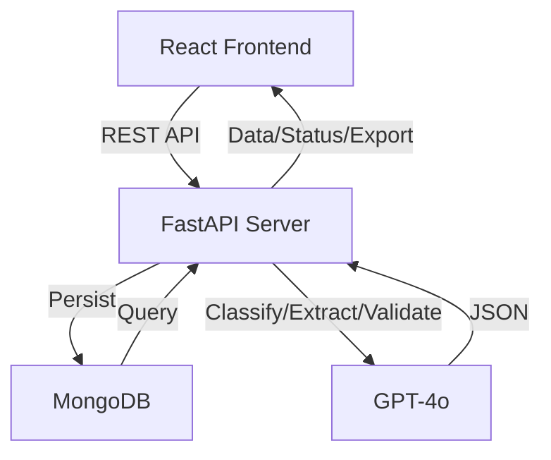
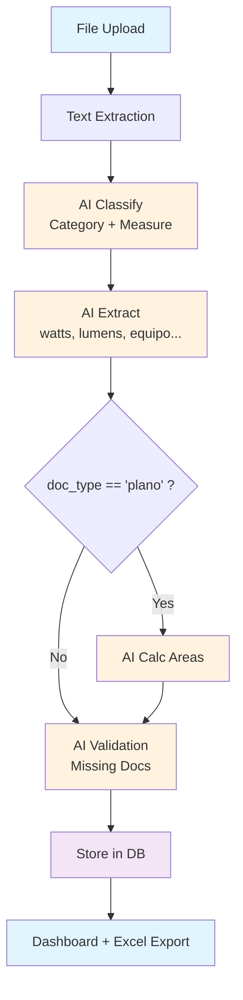

# EDGE Document Processor

[](https://github.com/gproatechnology/GProA_Edge/actions)
[]()
[]()

## 🚀 AI-Powered EDGE Certification Document Manager

**EDGE Document Processor** is an intelligent platform for EDGE certification projects. Upload construction documents (plans, spec sheets, photos), and GPT-4o automatically:
- Classifies into EDGE categories (DESIGN, ENERGY, WATER, MATERIALS)
- Extracts data (watts, lumens, equipment, brand/model)
- Calculates areas from floor plans
- Validates completeness (missing docs per measure)
- Generates Excel exports

MVP complete with 100% backend tests, 95% frontend tests.

## ✨ Features
- ✅ Project CRUD & management
- ✅ Multi-file upload with AI processing pipeline
- ✅ EDGE classification + measure detection
- ✅ Technical data extraction + area calculations
- ✅ Real-time EDGE status dashboard (categories, measures, gaps)
- ✅ Professional UI (React 19 + Tailwind + Shadcn)
- ✅ Excel export (data + areas sheets)

## 🛠 Tech Stack


## 🏗️ Architecture



## 🔄 Document Processing Flow



## 🎯 Screenshots


*(Run locally to generate screenshots)*

## 🚀 Quick Start

### Prerequisites
- **Docker Desktop** (Windows/Mac) or **Docker + Docker Compose** (Linux)
- **Node 18+** (optional, for frontend dev without Docker)
- **Python 3.12+** (optional, for backend dev without Docker)

---

## 🐳 **Option 1: Docker Compose (Recommended – Everything in One Command)**

La forma más fácil de iniciar todo el stack (backend + frontend) con un solo comando.

### **Desarrollo (Hot-Reload)**
```bash
# 1. Clona el repo y checkout a submain
git clone https://github.com/gproatechnology/GProA_EOSIS_Edge.git
cd GProA_EOSIS_Edge
git checkout submain

# 2. (Opcional) Configura variables de entorno
cp .env.docker .env  # Edita si quieres cambiar defaults

# 3. Inicia todos los servicios
docker-compose up

# 4. Accede:
#    Frontend: http://localhost:3000
#    Backend API: http://localhost:8000
#    API Docs (Swagger): http://localhost:8000/docs
```

**Hot-Reload activado:**
- Cambias código en `backend/` → FastAPI recarga automáticamente
- Cambias código en `frontend/` → React Fast Refresh recarga en browser

### **Producción (Imágenes Optimizadas)**
```bash
# Usa perfil de producción (sin hot-reload, imágenes más pequeñas)
docker-compose --profile production up -d

# Accede:
# Frontend: http://localhost:3000  (Nginx)
# Backend: http://localhost:8000
```

**Ver logs:**
```bash
docker-compose logs -f        # Todos
docker-compose logs -f backend # Solo backend
docker-compose logs -f frontend # Solo frontend
```

**Detener:**
```bash
docker-compose down           # Para pero conserva datos
docker-compose down -v        # Para y ELIMINA volúmenes (¡cuidado!)
```

**Más comandos:** Ver **[DOCKER_COMPOSE.md](DOCKER_COMPOSE.md)**.

---

## 🎯 **Option 2: Demo Mode (No Docker – Manual Local)**

Run backend and frontend separately without containers. Good for debugging.

### **Backend**
```bash
cd backend
python -m venv venv
# Windows:
venv\Scripts\activate
# Mac/Linux:
source venv/bin/activate

pip install -r requirements.txt
cp .env.example .env   # Edit if needed (defaults work for demo)
uvicorn server:app --reload --port 8000
```

### **Frontend**
```bash
cd frontend
yarn install
yarn start
```

App: http://localhost:3000  
API: http://localhost:8000

---

## 🎯 **Option 3: Render Cloud (No Docker Locally)**

Deploy directly to Render.com from GitHub (no Docker needed locally).

### **Demo Mode (Zero Config)**
1. Push to `submain` branch (already done)
2. En Render Dashboard → **New** → **Blueprint**
3. Select repo `gproatechnology/GProA_EOSIS_Edge`
4. Branch: **`submain`**
5. Click **"Apply Blueprint"** → Services auto-created
6. Espera 5 min → App live at `*.onrender.com`

**No variables needed** – `render.yaml` configures everything automatically.

See **[RENDER_DEPLOY_SUBMAIN.md](RENDER_DEPLOY_SUBMAIN.md)**.

---

## ☁️ **Deployment to Render**

### **🚀 Demo Mode (No API Keys)**
Deploy to Render **without MongoDB or OpenAI keys**. Uses SQLite + mock AI.

**Steps:**
1. Go to [Render.com](https://render.com) → **New** → **Blueprint**
2. Connect repo: `gproatechnology/GProA_EOSIS_Edge`
3. **Select branch: `submain`**
4. Apply blueprint → services auto-created
5. Wait → your app is live

**Variables auto-configured** in `render.yaml`:
- `MONGO_URL` → empty (uses SQLite)
- `OPENAI_API_KEY` → empty (uses mock AI)
- `DEMO_MODE` → `true`
- No manual setup needed.

Full guide: **[RENDER_DEPLOY_SUBMAIN.md](RENDER_DEPLOY_SUBMAIN.md)**.

---

### 🔧 **Advanced: Production Mode (with MongoDB + OpenAI)**

For real AI processing and cloud database:

| Variable | Description | Required |
|----------|-------------|----------|
| `MONGO_URL` | MongoDB Atlas connection string | ✅ Yes |
| `OPENAI_API_KEY` | OpenAI API key (GPT-4o) | ✅ Yes |
| `DEMO_MODE` | Set to `false` | No |
| `CORS_ORIGINS` | Allowed origins (e.g., `https://yourdomain.com`) | ✅ Yes |

Setup guide: **[ENV_SETUP.md](ENV_SETUP.md)**.

---

## ✅ Testing After Deployment

After deploying to Render, run the verification script:

```bash
# Clone the verification script to your local machine
curl -O https://raw.githubusercontent.com/gproatechnology/GProA_EOSIS_Edge/main/verify-deployment.sh
chmod +x verify-deployment.sh

# Run with your URLs
./verify-deployment.sh https://gproa-edge-backend.onrender.com https://gproa-edge-frontend.onrender.com
```

Or manually test:

1. **Backend health:** `GET https://...onrender.com/api/` → should return JSON
2. **Frontend loads:** Open frontend URL in browser
3. **Full flow:** Create project → upload file → process → export

See **[RENDER_STEP_BY_STEP.md](RENDER_STEP_BY_STEP.md)** for complete testing checklist.

---

## 🗺️ Roadmap (from PRD)
### Phase 2 (P1)
- Google Drive auto-sync
- PDF OCR support
- Batch processing progress

### Future (P2)
- ZIP exports
- Multi-user auth
- Real-time collab
- Advanced CV analysis

## 📁 Project Structure
```
GProA_Edge/
├── backend/          # FastAPI + MongoDB + GPT-4o
├── frontend/         # React + Tailwind + Shadcn UI
├── memory/PRD.md     # Product Requirements
├── test_reports/     # Test results (95-100%)
└── README.md         # This file
```

## 🤝 Contributing
1. Fork & clone
2. Create feature branch
3. `black . && yarn lint`
4. Test: `pytest backend/` & `yarn test`
5. PR to `main`

## 📄 License
MIT

## 🙏 Acknowledgments
- [EDGE Certification](https://edgebuildings.com/)
- [Emergent Integrations](https://emergent.sh)
- [Shadcn UI](https://ui.shadcn.com/)

---
⭐ Star us on GitHub!

