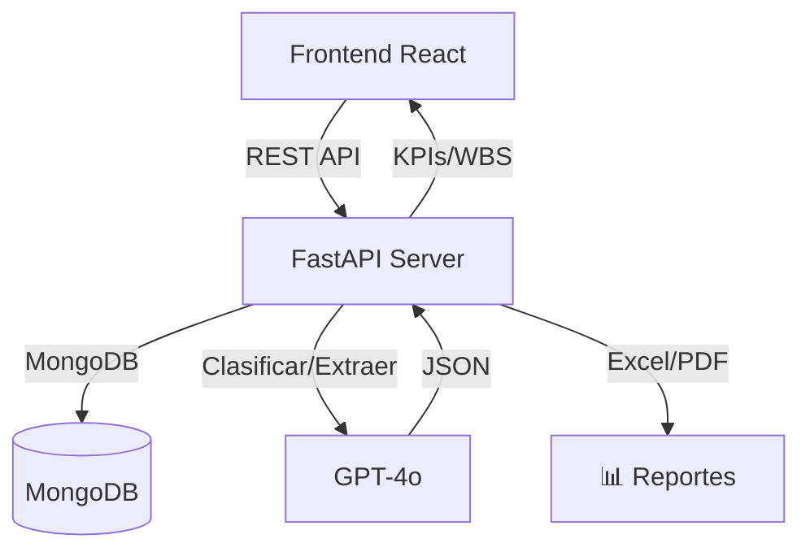
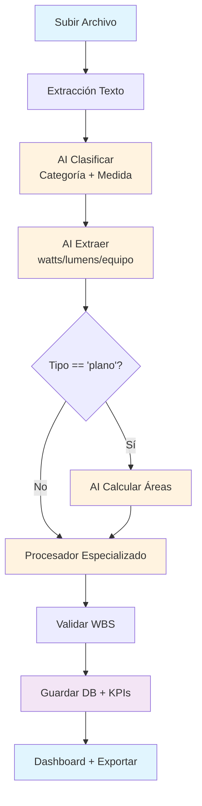

# EDGE Document Processor 🚀

[](https://github.com/gproatechnology/GProA_Edge/actions)
[]()
[]()

## Plataforma de Automatización Inteligente para Certificación EDGE

**EDGE Document Processor** es una plataforma profesional que automatiza completamente la certificación EDGE. Sube documentos de construcción (planos, fichas técnicas, fotos) y GPT-4o automáticamente:

- **Clasifica** en categorías EDGE (DESIGN, ENERGY, WATER, MATERIALS)
- **Extrae** datos técnicos (watts, lumens, equipos, marcas/modelos)
- **Calcula** áreas desde planos
- **Valida** completitud WBS (documentos faltantes por medida)
- **Genera** reportes Excel y PDF profesionales
- **Calcula** KPIs con umbrales EDGE (eficacia luminosa, COP HVAC, flujos agua)

**MVP completo** con **100% tests backend**, **95% frontend**.

## ✨ Funcionalidades Completas

### ✅ Gestión de Proyectos
- CRUD completo de proyectos + tipología
- Dashboard con métricas (archivos, procesados, cobertura)

### ✅ Procesamiento AI Automático (1-click)
```
Upload → Clasificar → Extraer → Procesador Especializado → Validar WBS → KPIs
```
- **Batch processing** con progreso real-time
- **Pipeline paralelo** para múltiples archivos

### ✅ Motor WBS (30+ Medidas EDGE)
```
ENERGY (11): EEM01-EEM23 (envolvente, HVAC, iluminación LED, renovables)
WATER (5): WEM01-WEM08 (griferías, sanitarios, riego, aguas grises)
MATERIALS (10): MEM01-MEM10 (reciclaje, madera certificada, bajo VOC)
DESIGN (1): Cálculo áreas y planos
```

### ✅ Procesadores Especializados
| Medida | Análisis |
|--------|----------|
| **EEM22/EEM23** | Tablas luminarias + eficacia global ponderada (lm/W ≥ 90) |
| **EEM09** | HVAC: COP, SEER, EER, refrigerante |
| **EEM16** | Paneles solares: capacidad kW, eficiencia |
| **WEM01/02** | Griferías/sanitarios: flujo lpm, descarga |

### ✅ Análisis y Reportes
- **Validación determinística** WBS (faltantes, progreso %)
- **KPIs** con umbrales EDGE + alertas
- **Excel 4 hojas**: Clasificación, WBS, EEM22, Áreas
- **PDF profesional** (ReportLab): Resumen, tabla medidas, evidencia, KPIs

## 🛠️ Stack Tecnológico


## 🏗️ Arquitectura



## 🔄 Flujo de Procesamiento



## 🎯 Estado del Proyecto

| Fase | Estado | Cobertura |
|------|--------|-----------|
| **Phase 1 MVP** | ✅ Completa | 100% Backend / 95% Frontend |
| **Phase 2 Automatización** | ✅ Completa | 30 medidas + 4 procesadores |
| **Phase 3 (Próxima)** | ⏳ Pendiente | Google Drive + PDF OCR |

**Tests ejecutados**: Backend 19/19, Frontend 22/23

## 🚀 Instalación Rápida

### Requisitos
```
MongoDB (local/Atlas)
Emergent Universal Key (https://emergent.sh)
Python 3.10+ | Node 18+ | Yarn
```

### Backend
```bash
cd backend
pip install -r requirements.txt
cp .env.example .env
# Configurar: MONGO_URL, EMERGENT_LLM_KEY, DB_NAME
uvicorn server:app --reload --port 8000
```
**Docs API**: [http://localhost:8000/docs](http://localhost:8000/docs)

### Frontend
```bash
cd frontend
yarn install
yarn start
```
**App**: [http://localhost:3000](http://localhost:3000)

## 📋 Endpoints Principales (35+)

| Método | Endpoint | Descripción |
|--------|----------|-------------|
| `POST` | `/api/projects` | Crear proyecto |
| `GET` | `/api/projects` | Listar proyectos |
| `POST` | `/api/projects/{id}/files` | Subir archivo |
| `POST` | `/api/projects/{id}/process-edge` | **Procesar EDGE completo** (batch + progreso) |
| `GET` | `/api/projects/{id}/wbs-validation` | Validación WBS determinística |
| `GET` | `/api/projects/{id}/kpis` | KPIs por medida |
| `GET` | `/api/projects/{id}/export-excel` | **Excel 4 hojas** |
| `GET` | `/api/projects/{id}/export-pdf` | **PDF profesional** |

## 📁 Estructura del Proyecto

```
GProA_Edge/
├── backend/                 # FastAPI + MongoDB
│   ├── server.py            # API principal (35+ endpoints)
│   ├── edge_rules.py        # WBS 30+ medidas
│   ├── edge_processors.py   # Procesadores especializados
│   ├── pdf_generator.py     # Reportes PDF
│   └── requirements.txt     # 90+ dependencias
├── frontend/                # React 19 + Shadcn UI
│   ├── src/components/      # 40+ componentes UI
│   ├── src/App.js           # Router + Layout
│   └── design_guidelines.json
├── memory/PRD.md            # Product Requirements Document
├── test_reports/            # Resultados tests (JSON)
├── backend_test.py          # Suite de pruebas automatizada
└── README.md                # ← Actualizado
```

## 🗺️ Roadmap (desde PRD.md)

### Phase 3 (P1 - Próxima)
- [ ] Google Drive auto-sync
- [ ] PDF OCR support
- [ ] Procesadores adicionales (EEM01, EEM05...)
- [ ] Calculadora de puntaje EDGE

### Phase 4 (P2 - Futuro)
- [ ] ZIP export estructura EDGE
- [ ] Autenticación multi-usuario
- [ ] Colaboración real-time
- [ ] Análisis CV avanzado (planos)

## 🤝 Contribuir

1. `git clone` + `yarn install` + `pip install -r backend/requirements.txt`
2. Formateo: `black . && yarn lint`
3. Tests: `pytest backend/` + `yarn test`
4. Branch: `feat/nombre-descriptivo`
5. PR a `main`

## 📄 Licencia
MIT

## 🙏 Agradecimientos
- **[EDGE Buildings](https://edgebuildings.com/)** - Estándar de certificación
- **[Emergent](https://emergent.sh)** - Integración GPT-4o
- **[Shadcn UI](https://ui.shadcn.com/)** - Componentes profesionales

---
⭐ **¡Dale estrella en GitHub!** 🚀
