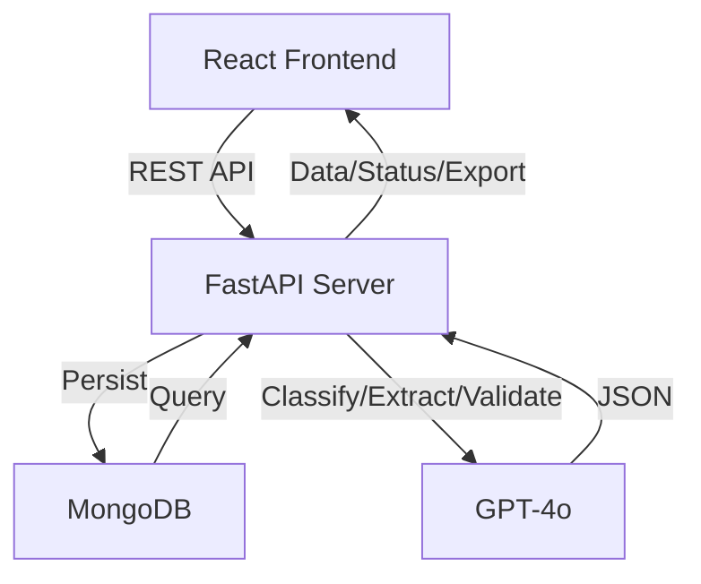
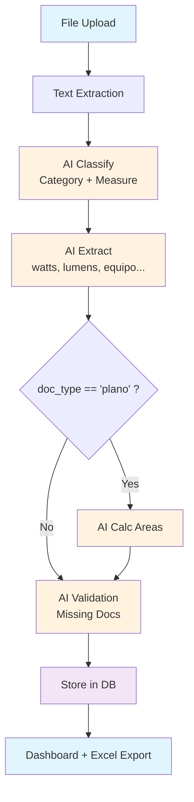

# EDGE Document Processor

[](https://github.com/gproatechnology/GProA_Edge/actions)
[]()
[]()

## 🚀 AI-Powered EDGE Certification Document Manager

**EDGE Document Processor** is an intelligent platform for EDGE certification projects. Upload construction documents (plans, spec sheets, photos), and GPT-4o automatically:
- Classifies into EDGE categories (DESIGN, ENERGY, WATER, MATERIALS)
- Extracts data (watts, lumens, equipment, brand/model)
- Calculates areas from floor plans
- Validates completeness (missing docs per measure)
- Generates Excel exports

MVP complete with 100% backend tests, 95% frontend tests.

## ✨ Features
- ✅ Project CRUD & management
- ✅ Multi-file upload with AI processing pipeline
- ✅ EDGE classification + measure detection
- ✅ Technical data extraction + area calculations
- ✅ Real-time EDGE status dashboard (categories, measures, gaps)
- ✅ Professional UI (React 19 + Tailwind + Shadcn)
- ✅ Excel export (data + areas sheets)

## 🛠 Tech Stack


## 🏗️ Architecture



## 🔄 Document Processing Flow



## 🎯 Screenshots


*(Run locally to generate screenshots)*

## 🚀 Quick Start

### Prerequisites
- Python 3.10+ (recommended: Python 3.12 for best aiosqlite compatibility)
- Node 18+, Yarn (for frontend)
- MongoDB (optional – only needed for production, not demo)
- [OpenAI API Key](https://platform.openai.com/api-keys) (optional – only needed for production, not demo)

### 🎯 Demo Mode (Zero Config – Recommended for Testing)
Run the application **without MongoDB or OpenAI** using SQLite + mock AI responses:

```bash
# Backend (auto-detects demo mode)
cd backend
cp .env.example .env  # Keep defaults: MONGO_URL empty, OPENAI_API_KEY empty
pip install -r requirements.txt
uvicorn server:app --reload --port 8000
# API docs: http://localhost:8000/docs

# Frontend (in another terminal)
cd frontend
yarn install
yarn start
# App: http://localhost:3000
```

**What happens in demo mode:**
- ✅ SQLite database created automatically at `backend/data/gproa_edge.db`
- ✅ AI classification & extraction uses deterministic mock responses
- ✅ All features work: upload, process, validate, export (Excel/PDF)
- ✅ No external API calls – perfect for demos, offline testing, CI/CD

---

## ☁️ Deployment to Render

### 🎯 **Deploy Demo Mode (No API Keys Required)**
Deploy instantly without configuring MongoDB or OpenAI. Uses SQLite + mock AI.

**Steps:**
1. Go to [Render.com](https://render.com) → **New** → **Blueprint**
2. Connect repo: `gproatechnology/GProA_EOSIS_Edge`
3. **Select branch: `submain`** (demo-ready branch)
4. Apply blueprint → services auto-created
5. Wait ~5 minutes → your app is live at `*.onrender.com`

**Variables are pre-configured** in `render.yaml`:
- `MONGO_URL` → empty (SQLite)
- `OPENAI_API_KEY` → empty (mock AI)
- `DEMO_MODE` → `true`
- `CORS_ORIGINS` → `*`

No manual environment setup needed. See **[RENDER_DEPLOY_SUBMAIN.md](RENDER_DEPLOY_SUBMAIN.md)** for full details.

---

### 🔧 **Advanced: Production Mode (with MongoDB + OpenAI)**
For real AI processing and persistent cloud database:

**Backend Environment Variables:**
| Variable | Description | Required |
|----------|-------------|----------|
| `MONGO_URL` | MongoDB Atlas connection string | ✅ Yes |
| `OPENAI_API_KEY` | OpenAI API key (GPT-4o) | ✅ Yes |
| `DEMO_MODE` | Set to `false` | No (default) |

**Frontend Environment Variables:**
| Variable | Description |
|----------|-------------|
| `REACT_APP_BACKEND_URL` | Backend URL (e.g., `gproa-edge-backend.onrender.com`) |

See **[ENV_SETUP.md](ENV_SETUP.md)** for detailed production configuration.

---

## ✅ Testing After Deployment

After deploying to Render, run the verification script:

```bash
# Clone the verification script to your local machine
curl -O https://raw.githubusercontent.com/gproatechnology/GProA_EOSIS_Edge/main/verify-deployment.sh
chmod +x verify-deployment.sh

# Run with your URLs
./verify-deployment.sh https://gproa-edge-backend.onrender.com https://gproa-edge-frontend.onrender.com
```

Or manually test:

1. **Backend health:** `GET https://...onrender.com/api/` → should return JSON
2. **Frontend loads:** Open frontend URL in browser
3. **Full flow:** Create project → upload file → process → export

See **[RENDER_STEP_BY_STEP.md](RENDER_STEP_BY_STEP.md)** for complete testing checklist.

---

## 🗺️ Roadmap (from PRD)
### Phase 2 (P1)
- Google Drive auto-sync
- PDF OCR support
- Batch processing progress

### Future (P2)
- ZIP exports
- Multi-user auth
- Real-time collab
- Advanced CV analysis

## 📁 Project Structure
```
GProA_Edge/
├── backend/          # FastAPI + MongoDB + GPT-4o
├── frontend/         # React + Tailwind + Shadcn UI
├── memory/PRD.md     # Product Requirements
├── test_reports/     # Test results (95-100%)
└── README.md         # This file
```

## 🤝 Contributing
1. Fork & clone
2. Create feature branch
3. `black . && yarn lint`
4. Test: `pytest backend/` & `yarn test`
5. PR to `main`

## 📄 License
MIT

## 🙏 Acknowledgments
- [EDGE Certification](https://edgebuildings.com/)
- [Emergent Integrations](https://emergent.sh)
- [Shadcn UI](https://ui.shadcn.com/)

---
⭐ Star us on GitHub!

