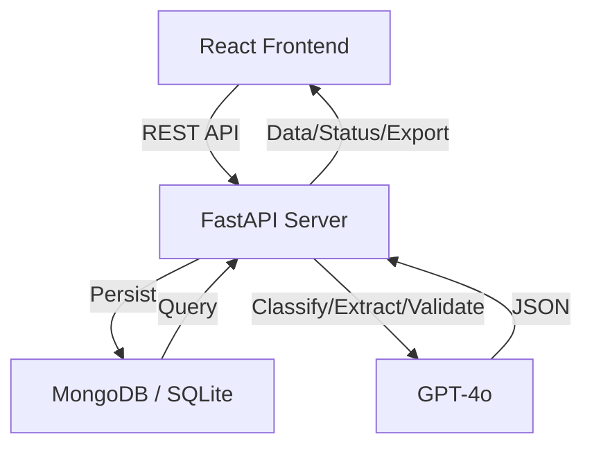
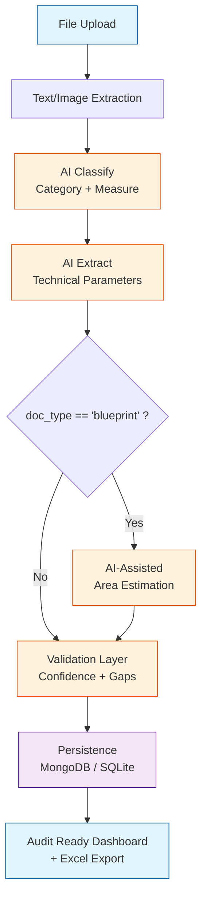

# EDGE Document Processor

[](https://github.com/gproatechnology/GProA_Edge/actions)
[]()
[]()

## 🚀 AI-Powered Document Intelligence for EDGE Certification

**EDGE Document Processor** is a professional-grade platform designed to streamline the complex documentation required for EDGE certification. It acts as an **intelligent document engine** that transforms unstructured construction data into structured, auditable certification inputs.

- **Intelligent Classification**: Automatically categorizes documents into EDGE categories (ENERGY, WATER, MATERIALS).
- **Assisted Data Extraction**: High-precision extraction of technical parameters (watts, lumens, U-values, brands/models).
- **AI-Guided Area Estimation**: Tools to assist in extracting spatial data from floor plans (Roadmap: Full CV/CAD integration).
- **Compliance Validation**: Real-time detection of missing documentation per measure.
- **Auditable Exports**: Structured Excel outputs ready for certification submission.

---

## ✨ Features
- 📋 **Project Governance**: Centralized management of certification projects and typologies.
- 📂 **Multi-Source Pipeline**: Upload and process various file types (PDF, Images, Excel).
- 🧠 **Context-Aware Processing**: GPT-4o powered classification and technical extraction.
- ⚖️ **Confidence & Traceability**: Integrated confidence scoring per extraction and source referencing.
- 📊 **Executive Dashboard**: Real-time monitoring of project status, documentation gaps, and EDGE metrics.
- 🎨 **Premium UI**: Modern, responsive interface built with React 19, Tailwind, and Shadcn UI.
- 📤 **Enterprise Export**: Advanced Excel generation with detailed data sheets.

---

## 🛠 Tech Stack


---

## 🏗️ Architecture



---

## 🔄 Document Processing Flow



---

## 🛡️ Trust & Reliability Layer (Auditor Ready)

Unlike generic extraction tools, this processor is built for the high-stakes environment of green building certification:

- **Confidence Scoring**: Every extracted value is accompanied by an AI-generated confidence score (0-1). Low-confidence values are flagged for human review.
- **Source Referencing**: (In Development) Direct mapping of extracted data to specific documents and pages to ensure auditability.
- **Hybrid Validation**: Combines Large Language Models with deterministic business rules for EDGE measures.

---

## 🎯 Screenshots


*(Run locally to generate screenshots)*

---

## 🚀 Quick Start

### Prerequisites
- **Docker Desktop** (Windows/Mac) or **Docker + Docker Compose** (Linux)
- **Node 18+** (optional, for frontend dev without Docker)
- **Python 3.12+** (optional, for backend dev without Docker)

---

## 🐳 **Option 1: Docker Compose (Recommended)**

La forma más fácil de iniciar todo el stack (backend + frontend) con un solo comando.

### **Desarrollo (Hot-Reload)**
```bash
# 1. Clona el repo y checkout a submain
git clone https://github.com/gproatechnology/GProA_EOSIS_Edge.git
cd GProA_EOSIS_Edge
git checkout submain

# 2. Inicia todos los servicios
docker-compose up
```

---

## 🧪 Demo Mode vs 🏭 Production Mode

| Feature | **Demo Mode** (Default) | **Production Mode** |
|---------|-------------------------|---------------------|
| **Database** | SQLite (Local/Ephemeral) | MongoDB Atlas (Cloud/Persistent) |
| **AI Engine** | Mock AI (Hardcoded logic) | OpenAI GPT-4o (Real-time Analysis) |
| **Cost** | $0 (No API Keys needed) | Pay-per-token (OpenAI API Key) |
| **Accuracy** | Simulation only | Real Document Processing |
| **Use Case** | UX Review & Feature Demos | Real Project Certification |

---

### 🔧 **Advanced: Production Mode (with MongoDB + OpenAI)**

For real AI processing and cloud database:

| Variable | Description | Required |
|----------|-------------|----------|
| `MONGO_URL` | MongoDB Atlas connection string | ✅ Yes |
| `OPENAI_API_KEY` | OpenAI API key (GPT-4o) | ✅ Yes |
| `DEMO_MODE` | Set to `false` | No |
| `CORS_ORIGINS` | Allowed origins (e.g., `https://yourdomain.com`) | ✅ Yes |

Setup guide: **[ENV_SETUP.md](docs/ENV_SETUP.md)**.

---

## 🗺️ Roadmap (Enterprise Readiness)
### 🚀 Phase 2 (P1: Professionalization)
- **Traceability Engine**: View source document page directly next to extracted data.
- **Enhanced OCR**: Advanced pre-processing for low-quality PDF scans.
- **Google Drive / Sharepoint**: Automatic synchronization of project folders.
- **Progress Tracking**: Real-time progress bars for batch document processing.

### 🏢 Phase 3 (P2: Enterprise & Security)
- **RBAC Security**: Role-Based Access Control (Admin, Auditor, Consultant).
- **Multi-Tenant Architecture**: Complete data isolation for different client organizations.
- **Advanced CV Integration**: Computer Vision for deterministic area calculation from CAD/PDF.
- **API for Integrations**: Connect with existing ERP or Project Management tools.

---

## 📁 Project Structure
```
GProA_Edge/
├── backend/          # FastAPI + MongoDB + GPT-4o
├── frontend/         # React + Tailwind + Shadcn UI
├── docs/             # Technical documentation & guides
├── memory/PRD.md     # Product Requirements
└── README.md         # This file
```

---

## 🤝 Contributing
1. Fork & clone
2. Create feature branch
3. PR to `main`

## 📄 License
MIT

## 🙏 Acknowledgments
- [EDGE Certification](https://edgebuildings.com/)
- [Emergent Integrations](https://emergent.sh)
- [Shadcn UI](https://ui.shadcn.com/)

---
⭐ Star us on GitHub!
